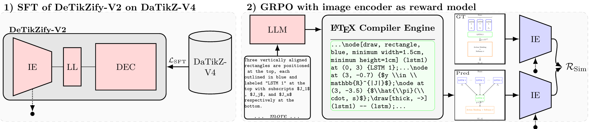

# TikZilla: Scaling Text-to-TikZ with High-Quality Data and Reinforcement Learning

<p align="center">
  
</p>

<p align="center"> <a href="https://arxiv.org/abs/2603.03072">  </a> <a href="https://openreview.net/forum?id=rJv2byEWA3">  </a> <a href="https://huggingface.co/collections/nllg/tikzilla">  </a> <a href="https://github.com/NL2G/TikZilla">  </a> </p>

TikZilla is a family of open-source language models for **Text-to-TikZ generation**. Built on **DaTikZ-V4**, the largest Text-to-TikZ dataset to date, and trained with both **supervised fine-tuning (SFT)** and **reinforcement learning (RL)**, TikZilla generates high-quality, executable TikZ figures directly from natural language descriptions and achieves state-of-the-art performance among open models.


## Overview

TikZilla advances Text-to-TikZ generation through three key contributions:

1. **DaTikZ-V4** – a large-scale, high-quality Text-to-TikZ dataset containing over 2 million TikZ figures collected from arXiv, GitHub, TeX Stack Exchange, curated sources, and synthetic data.

2. **Reinforcement Learning for Text-to-TikZ** – a novel RL stage that optimizes visual-semantic alignment using image-based reward models.

3. **Strong Open Models** – compact 3B and 8B parameter models that outperform previous open-source approaches and achieve competitive performance against proprietary systems.

<p align="center">
  
</p>


## Dependencies

This project requires a full [TeX Live](https://www.tug.org/texlive) installation tested with TeX Live 2025 / pdfTeX `3.141592653-2.6-1.40.28`, [Ghostscript](https://www.ghostscript.com) `10.03.0`, and [Poppler](https://poppler.freedesktop.org) `24.07.0`.

### DaTikZ-V4

DaTikZ-V4 was built with Python `3.10.16`. Its requirements can be installed with:

```sh
pip install -r Requirements/requirements_datikz.txt
```

All relevant scripts for scraping and processing data from arXiv, GitHub, TeX Stack Exchange, curated sources, and synthetic data can be found in the `DaTikZ-V4/` directory.

### TikZilla SFT

TikZilla SFT requires Python `3.12`. Its requirements can be installed with:

```sh
pip install -r Requirements/requirements_sft.txt
```

These requirements are used for:

- VLM description generation (`VLM_Descriptions/generate_descriptions.py`)
- LLM debugging (`LLM_Debug/debug_tikz.py`)
- Supervised fine-tuning
  - `Training/train_detikzify_sft.py`
  - `Training/train_tikzilla_sft.py`
- Model evaluation (`Evaluation/eval_tikzilla.py`)

### TikZilla RL

TikZilla RL requires Python `3.12`. Its requirements can be installed with:

```sh
pip install -r Requirements/requirements_rl.txt
```

For reward computation, the RL pipeline additionally expects the following models to be available locally:

```sh
git clone https://huggingface.co/nllg/detikzify-v2-8b
git clone https://huggingface.co/google/siglip-so400m-patch14-384
```

The RL setup uses DeTikZify, DreamSim, and SigLIP-based reward signals for semantic image similarity. These requirements are used for running:

```sh
python Training/train_tikzilla_rl.py
```


## Citation

If TikZila have been beneficial for your research or applications, we kindly request you to acknowledge this by citing them as follows:

```bibtex
@inproceedings{greisinger2026tikzilla,
    title={TikZilla: Scaling Text-to-TikZ with High-Quality Data and Reinforcement Learning},
    author={Christian Greisinger and Steffen Eger},
    booktitle={The Fourteenth International Conference on Learning Representations},
    year={2026},
    url={https://openreview.net/forum?id=rJv2byEWA3}
}
```